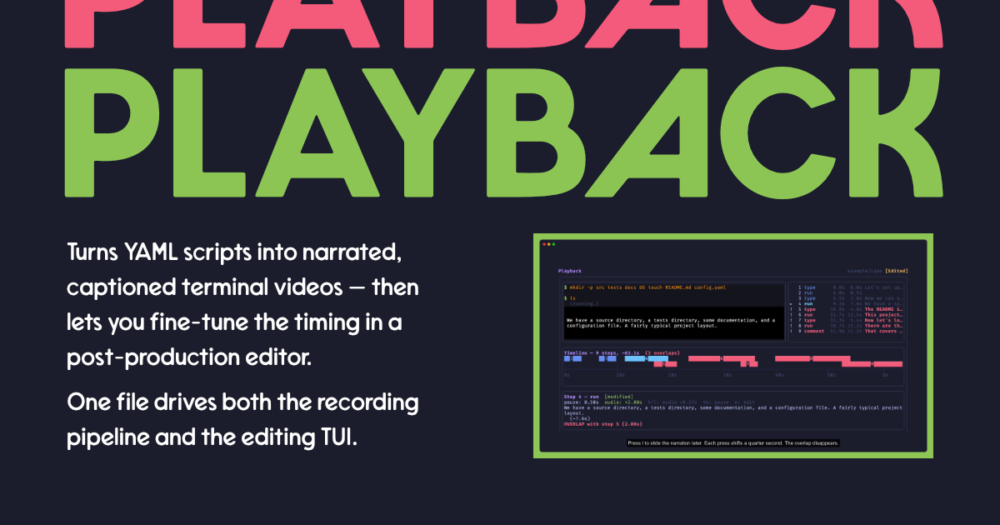

# Playback



> “Turns YAML scripts into narrated, captioned terminal videos — then lets you fine-tune the timing in a post-production editor. One file drives both the recording pipeline and the editing TUI.”

## TL;DR

### Installing requirements

This primarily runs on macOS, but should work fine on Linux using the same `brew` steps. Windows users will want to use WSL.

We assume an updated [Homebrew](https://brew.sh) is in working order.

```sh
brew install asdf   ## We install one package manager with another.
asdf install        ## Installs the things from `.tool-versions`
npm install         ## Installs the Node.js dependencies.
npm run setup       ## Sets us up the bomb.
```

### What Playback is

This comes in two parts:

1. `playback-cli`
2. `playback-tui`

You can write the script for what you want to run in the CLI: `tape.yaml`.

Add some metadata for it: `meta.yaml`.

You run this using `playback-cli`.

### `playback-cli`

Run the `playback-cli` command to build the TUI demo.

```sh
npm run playback:tape -- studio/demo/tui --web --mkv
```

That’s the Playback CLI.

If it seems a bit out of sync, use the `playback-tui`.

### `playback-tui`

Run the `playback-cli` command to edit the TUI demo.

```sh
npm run playback:edit -- studio/demo/tui
```

That’s the Playback TUI.

### Demonstration

Run the command to build *ALL THE FORMATS* and watch the videos.

```sh
npm run playlist:build:web:mkv
```

That’s the super-quick version of everything.

And now, the `--verbose` version.

## How it works

Playback has two halves:

1. **Create** — a TypeScript pipeline that takes a YAML tape file and produces a finished video.
  It generates a [VHS](https://github.com/charmbracelet/vhs) terminal recording, synthesises a voiceover track with [piper-tts](https://github.com/rhasspy/piper), generates caption tracks (WebVTT, SRT), and stitches everything together with `ffmpeg`. Out comes an `.mp4`, a `.gif`, and a set of caption files.

2. **Edit** — a Go/[Bubbletea](https://github.com/charmbracelet/bubbletea) TUI that opens the same YAML file and shows a visual audio timeline.
  You see where any narration clips overlap, nudge them with the arrow keys, and save the adjusted timing back to the tape. Two accessible alternatives are available: a sequential interactive mode for screen reader users, and a plain-text timing report for piping into other tools.

## Project structure

Each video lives in its own directory with a `tape.yaml` and optional `meta.yaml`:

```text
studio/
  example/
    tape/              # standalone example tape (try the TUI with this)
      tape.yaml        # pipeline — steps, narration, timing
      meta.yaml        # metadata — title, description, version, locale, poster
    skills/            # workspace-backed example tape
  demo/
    tui/               # self-referential demo video of the TUI
    accessible/        # accessible mode demo
  build-studio.sh      # builds the demo videos
```

Tapes can live anywhere — in this repo’s `studio/` directory, in a consuming project’s own `tapes/` directory, or wherever makes sense. Point the pipeline or TUI at a directory containing a `tape.yaml` and it works.

### `tape.yaml`

The tape file describes what happens in the terminal and what the narrator says.

Five action types cover most workflows:

- `type` — types a command and presses Enter
- `run` — waits for the previous command to finish
- `key` — sends a keystroke without Enter (for TUI interaction)
- `comment` — pauses for narration with no terminal interaction
- `narrate` — starts narration and fires commands concurrently

```yaml
title: Exploring a project structure
output: demo-example
steps:
  - action: narrate
    narration: >
      Let’s set up a small project to explore. We’ll create some
      directories, add a config file, then look at the structure.
    commands:
      - mkdir -p src tests docs && touch README.md config.yaml
      - ls

  - action: run
    narration: >
      We have a source directory, a tests directory, some documentation,
      and a configuration file. A typical project layout.
    pause: 0.5

  - action: comment
    narration: >-
      That covers the project structure. In the next video, we’ll dive
      into the configuration module.
```

The `narrate` action is useful for "cold open" sequences where you want to explain context while navigating the terminal. The pipeline spaces commands evenly across the narration duration — the voice starts first and the terminal keeps up underneath.

### `meta.yaml`

The metadata file describes the episode and controls how the pipeline produces it. Every tape directory needs one alongside `tape.yaml`.

- `title` — episode title, used in output filenames and the TUI title bar
- `description` — short summary, included in the web manifest when using `--web`
- `series` / `episode` — organise tapes into numbered series for the tape picker
- `locale` — BCP 47 language tag (defaults to `en-GB`)
- `poster` — step number to extract as a still frame; ignored when `poster.png` exists in the tape directory
- `tags` — freeform labels for filtering and grouping
- `version` — semver string, written into the web manifest
- `voices` — one or more `piper-tts` voice names; the pipeline generates a full output set per voice

```yaml
title: Exploring a project structure
description: >
  A sample tape with intentional timing overlaps, designed as a demo
  for the playback TUI editor.
episode: 1
locale: en-GB
poster: 5
series: demo
tags:
  - demo
  - example
version: "1.0.0"
voices:
  - northern_english_male   # default if omitted
  # - southern_english_female
```

**Poster image priority:** `poster.png` in the tape directory → `poster` frame number in `meta.yaml` → no poster.

**Voices:** `northern_english_male` by default. Specify `voices` to override or generate one output per voice. Both voices are en-GB `piper-tts` models downloaded by `npm run setup`.

### Output

Running `npm run playback:tape -- studio/example/tape` produces:

```text
blockbuster/
  studio/
    example/
      tape/
        tape.tape        # generated VHS tape
        tape.mp4         # final video with voiceover
        tape.gif         # GIF version for READMEs and docs
        tape.vtt         # WebVTT captions (primary)
        tape.srt         # SRT captions (fallback)
        tape.ass         # ASS captions (used internally for burn-in)
        tape.png         # poster image (if generated)
        chapters.txt     # FFMETADATA1 chapter markers (for benchmarking)
        script.txt       # narration script (for reference)
        segments/        # per-voice synthesised audio segments
```

## Stack

**Create** (TypeScript):
- [Valibot](https://valibot.dev/) for tape schema validation,
- [VHS](https://github.com/charmbracelet/vhs) for terminal recording,
- [piper-tts](https://github.com/rhasspy/piper) for local TTS,
- [ffmpeg-full](https://ffmpeg.org/) for audio/video stitching and subtitle burn-in
  (requires the `ffmpeg-full` Homebrew formula for `libass` support).

**Edit** (Go):
- [Bubbletea](https://github.com/charmbracelet/bubbletea) for the TUI,
- [Lipgloss](https://github.com/charmbracelet/lipgloss) for layout and styling,
- [Glamour](https://github.com/charmbracelet/glamour) for rendered markdown overlays

See [docs/TUI.md](docs/TUI.md) for the full design.

## Installation

Playback has two halves that install independently. Use what you need.

### In your project

**For anyone adding playback to an existing repo.** Install it as a dev
dependency:

```sh
npm install --save-dev playback-cli
```

This gives you the `playback` command for creating videos. You also need
the external tools it orchestrates:

- [ffmpeg](https://ffmpeg.org/) (the `ffmpeg-full` Homebrew formula for `libass` subtitle support)
- [VHS](https://github.com/charmbracelet/vhs) for terminal recording
- [piper-tts](https://github.com/rhasspy/piper) for local voice synthesis

The TUI timing editor ships as a standalone Go binary. Install it
separately if you need post-production editing:

```sh
go install github.com/philsherry/playback/tui/cmd/playback-tui@latest
```

Then create a `playback.config.ts` in your project root:

```typescript
import { defineConfig } from 'playback-cli/config';

export default defineConfig({
  tapesDir: 'tapes',
  outputDir: 'blockbuster',
  voicesDir: 'voices',
  defaultVoices: ['northern_english_male'],
});
```

See [govuk-design-system-skills](https://github.com/philsherry/govuk-design-system-skills) for a working example of a repo with 18 tapes, workspace config, and the full pipeline set up.

### For development

**For contributors working on playback itself.** Clone the repo and run the
setup script:

```sh
npm install        # also runs husky to set up git hooks
npm run setup      # installs dependencies, downloads voice models, and builds
```

`npm run setup` requires Homebrew and [`uv`](https://github.com/astral-sh/uv). It runs `brew bundle` for `ffmpeg-full`, `VHS`, and `Vale`; installs `piper-tts` via `uv tool install piper-tts`; downloads default voice models; and runs `vale sync` to fetch prose styles. A `postsetup` hook automatically runs `npm run build` (TypeScript compilation + Go TUI binary) and `npm link` to register the `playback` binary globally. This somewhat-opinionated installation expects that you manage your Go, Python 3.13, and `uv` installs via [`asdf`](https://asdf-vm.com/) using the included `.tool-versions` file.

`tsconfig.json` sets `"ignoreDeprecations": "6.0"` to silence a TypeScript 6 deprecation warning about `baseUrl` that originates from `rxjs` (a transitive dependency of `tsup`), not from playback’s own source. Remove the flag once `rxjs` updates their tsconfig.

## Quick start (development)

This walkthrough uses the development workflow. If you installed playback into
your own project, jump straight to [Usage](#usage).

### 1. Install and set up

```sh
npm install
npm run setup
```

Setup installs external tools, downloads voice models, and builds everything automatically.

### 2. Try the TUI editor

```sh
npm run playback:demo
```

This opens a tape with intentional narration overlaps. Press <kbd>j</kbd>/<kbd>k</kbd> to navigate steps, <kbd>l</kbd>/<kbd>h</kbd> to nudge audio timing, <kbd>s</kbd> to save, <kbd>q</kbd> to quit. Press <kbd>?</kbd> for the full keybinding reference.

### 3. Run the pipeline

```sh
npm run playback:tape -- studio/example/tape
```

This generates a `VHS` recording, synthesises voiceover, creates captions, and stitches the final `.mp4` and `.gif` into `blockbuster/studio/example/tape/`.

### 4. Set up workspace sources

Skip this for standalone tapes like `studio/example/tape`. Do this before building
any tape that uses `{{PLACEHOLDER}}` values:

```sh
cp workspace.example.yaml workspace.yaml
npx -y degit philsherry/govuk-design-system-skills workspace/govuk-design-system-skills
```

See [studio/README.md](studio/README.md) for a more detailed walkthrough.

## Usage

When working on playback itself, use the `npm run` form:

```sh
# Validate a tape without recording
npm run validate -- studio/example/tape

# Build all tapes in the configured tapesDir
npm run playlist:build

# Generate all outputs from a tape
npm run playback:tape -- studio/example/tape

# Generate VHS tape only (no audio/video stitching)
npm run playback:tape -- studio/example/tape --vhs-only

# Generate captions only
npm run playback:tape -- studio/example/tape --captions-only

# Open the timing editor TUI
npm run playback:edit -- studio/example/tape

# Sequential interactive mode (screen reader-friendly, no alt screen)
npm run playback:edit:accessible -- studio/example/tape

# Plain-text timing report (pipe-friendly, no interaction)
npm run playback:edit:report -- studio/example/tape
```

In a consuming project, use the `playback` command directly:

```sh
# Validate a tape
playback validate tapes/s1-getting-started/01-install

# Run the full pipeline
playback tape tapes/s1-getting-started/01-install

# Edit timing (requires the Go TUI binary)
playback-tui tapes/s1-getting-started/01-install
```

### Timing and audio

The pipeline synthesises audio before recording the terminal, then adjusts step timing so the video never outpaces the narration. Three constants control the pacing:

| Constant | Default | Where | Purpose |
| -------- | ------: | ----- | ------- |
| `AUDIO_BUFFER` | 0.5 s | `src/cli.ts` | silence after each narration clip before the next step begins |
| `WORDS_PER_MINUTE` | 150 | `src/constants.ts` | estimated speech rate (pre-synthesis fallback for `--vhs-only`) |
| `NARRATION_GAP` | 0.25 s | `src/timeline/index.ts` | minimum gap between consecutive audio clips in the mix |

Increase `AUDIO_BUFFER` if the final video feels rushed. The effective breathing room between clips is `AUDIO_BUFFER + NARRATION_GAP`.

Use `--audit` after a pipeline run to compare actual WAV durations against pause values, or `--audit-fix` to write corrections back to `tape.yaml`:

```sh
npm run playback:tape -- studio/example/tape --audit
npm run playback:tape -- studio/example/tape --audit-fix
```

Use `--debug-overlay` to burn command labels into the video for timing verification:

```sh
npm run playback:tape -- studio/example/tape --debug-overlay
```

### Timing editor

See [docs/TUI.md](docs/TUI.md) for the full design and [studio/README.md](studio/README.md) for the demo video build process.

The accessible alternatives mentioned above:

- `playback:edit:accessible` — sequential interactive mode with line-by-line prompts instead of the full-screen TUI.
  No alternate screen buffer, no redraws, no spatial layout.
- `playback:edit:report` — non-interactive plain-text timing report. Useful
  for piping into other tools.

### Workspace

Tape commands can use named placeholders like `{{GDS_SKILLS_COMPONENTS_DIR}}` that playback resolves before recording. You define these in `workspace.yaml` at the project root — a single file that describes which external directories map into the recording sandbox.

`workspace.yaml` lives outside version control (it contains local paths). Copy the example to get started:

```sh
cp workspace.example.yaml workspace.yaml
```

Then clone external repos into the `workspace/` directory:

```sh
npx -y degit philsherry/govuk-design-system-skills workspace/govuk-design-system-skills
```

Tapes that don’t use placeholders (like `studio/example/tape/`) work without any workspace config. Tapes that reference `{{PLACEHOLDER}}` values need the corresponding source to be present first.

## Accessibility

The main point of `playback` is accessible videos by default:

- **Captions** — WebVTT with positioning and colour support; SRT as a universal fallback
- **Voiceover** — synthesised narration track on every video
- **Source** — the YAML tape file serves as a human-readable script anyone can read before watching

## Examples

### Real-world usage

The [govuk-design-system-skills](https://github.com/philsherry/govuk-design-system-skills) repo uses playback in production — 18 tapes across six series, with workspace config, voice selection, and the full pipeline. See [docs/CASE_STUDY.md](docs/CASE_STUDY.md) for the planning and production notes.

### Built-in demos

- [`studio/example/tape/`](studio/example/tape/) — standalone tape with no external dependencies; contains intentional timing overlaps for trying the TUI editor
- [`studio/example/skills/`](studio/example/skills/) — tape with workspace features; uses `{{GDS_SKILLS_COMPONENTS_DIR}}` and `{{GDS_SKILLS_AGENTS_DIR}}` placeholders
- [`studio/demo/tui/`](studio/demo/tui/) — self-referential demo of the TUI itself
- [`studio/demo/accessible/`](studio/demo/accessible/) — demo of the accessible editing mode

Try the example tape in the TUI editor:

```sh
npm run playback:edit -- studio/example/tape
```

## Documentation

- [studio/README.md](studio/README.md) — step-by-step demo walkthrough
- [docs/TUI.md](docs/TUI.md) — timing editor design, themes, keybindings, and accessibility modes
- [docs/VOICE.md](docs/VOICE.md) — voice synthesis setup, `piper-tts` tuning, and audio pipeline
- [docs/CASE_STUDY.md](docs/CASE_STUDY.md) — how we planned and produced 18 episodes for [govuk-design-system-skills](https://github.com/philsherry/govuk-design-system-skills)
- [CHANGELOG.md](CHANGELOG.md) — release history
- [BACKLOG.md](BACKLOG.md) — ideas and roadmap

---

Built for my own use, made public in case it’s useful. Documented for Future Phil, which means it’s documented for you too.
