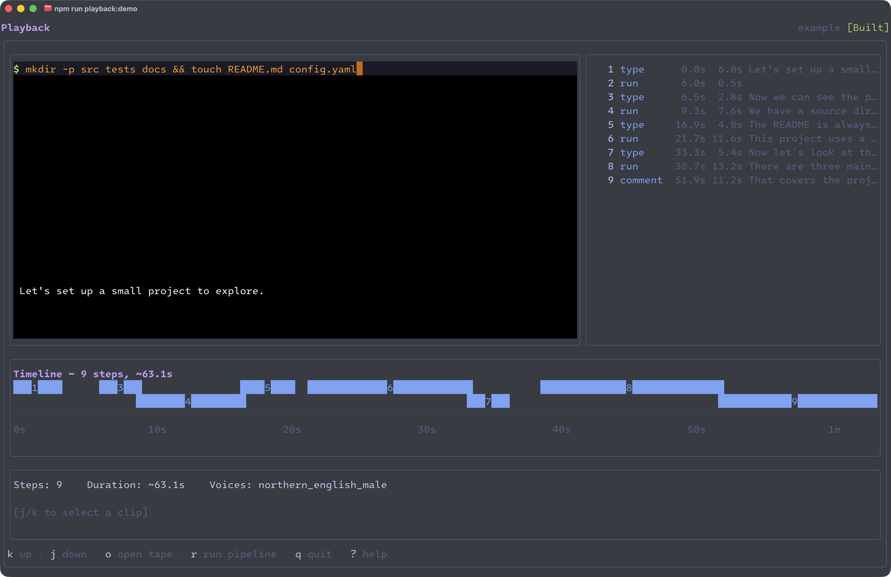

# Playback demo

Step-by-step walkthrough for trying the demo tapes. Start from the project root and work through in order.

## Step 1: Install and setup

If you haven't already:

```sh
npm install
npm run setup
```

Setup installs external tools, downloads voice models, and builds everything automatically.

`npm run setup` installs external tools (`VHS`, `piper-tts`, `ffmpeg-full`, `Vale`) and downloads the default voice model. See the main [README](../README.md#installation) for prerequisites.

## Step 2: Validate the demo tape

Check that the example tape parses correctly before running anything:

```sh
npm run validate -- studio/example/tape
```

You should see `✓ Valid`.

## Step 3: Run the pipeline

Generate a narrated, captioned video from the demo tape:

```sh
npm run playback:tape -- studio/example/tape
```

Output lands in `blockbuster/studio/example/tape/` — you'll get an `.mp4`, a `.gif`, caption files (`.vtt`, `.srt`, `.ass`), and a narration script.

## Step 4: Try the TUI editor

```sh
npm run playback:demo
```

This opens the timing editor with a tape that has intentional overlapping narration. Look for `!` markers in the step list.

1. Press <kbd>j</kbd> to move down to a step with an overlap.
2. Press <kbd>l</kbd> to slide the narration later, or <kbd>h</kbd> to slide it earlier.
3. Repeat until you clear all the overlaps.
4. Press <kbd>s</kbd> to save.
5. Press <kbd>q</kbd> to quit.

Other things to try:

- <kbd>?</kbd> — full keybinding reference
- <kbd>o</kbd> — tape picker (switch between tapes)
- <kbd>m</kbd> — view the tape's `PROMPT.md`
- <kbd>M</kbd> — edit metadata fields
- <kbd>r</kbd> — re-run the pipeline from within the TUI

### The Playback Terminal User Interface (TUI)



## Step 5: Try the skills example

Skip this if you only want the standalone demo. Run this before the
workspace-backed skills example:

```sh
cp workspace.example.yaml workspace.yaml
npx -y degit philsherry/govuk-design-system-skills workspace/govuk-design-system-skills
```

Then validate and run:

```sh
npm run validate -- studio/example/skills
npm run playback:tape -- studio/example/skills
```

## Step 6: Build the demo video (optional)

```sh
npm run playback:studio:build
```

This produces a narrated screen recording of the TUI fixing timing issues. Output lands in `studio/dist/`. This step takes longer — it records a full `VHS` session, synthesises audio, and stitches the final video.

## What's in here

```text
studio/
  example/
    tape/              the tape the TUI opens (has intentional overlaps)
      tape.yaml            active copy — edited by the TUI, reset before each build
      tape.pristine.yaml   clean backup with overlaps intact
      meta.yaml            episode metadata
      PROMPT.md            human-readable description

    skills/            example tape using workspace features (requires clone)
      tape.yaml            uses {{GDS_SKILLS_*}} placeholders from workspace.yaml
      meta.yaml            episode metadata
      PROMPT.md            human-readable description with clone instructions

  demo/
    tui/               narration and recording script for the demo video
      tape.yaml            narration text and timing for the voiceover
      tui.tape             VHS script that drives the TUI via keystrokes
      meta.yaml            episode metadata
      PROMPT.md            human-readable description

    accessible/        the accessible timing editor in action
      tape.yaml            sequential prompts, nudge, undo, quit
      meta.yaml            episode metadata
      PROMPT.md            human-readable description

  build-studio.sh      orchestrates the full studio build
  assets/              screenshots and images for this README
  build/               intermediate build artefacts (git-ignored)
  dist/                final output (git-ignored)
    demo/
      tui/             TUI demo video, captions, poster, manifest
      accessible/      accessible mode demo video, captions, poster, manifest
```

## How the build works

The `build-studio.sh` script orchestrates the full build:

1. **Reset** — restores `tape.pristine.yaml` over `tape.yaml` in `example/tape/` so the tape starts with timing overlaps.
2. **Build demo/tui** — runs the full pipeline (`tsx src/cli.ts tape studio/demo/tui --web`). The pipeline synthesises audio, back-fills timing, records VHS from the project root (via `vhsCwd: "."` in meta.yaml), generates captions, and stitches the final video with poster.
3. **Build demo/accessible** — same pipeline, same process.
4. **Copy to dist** — copies web-ready output (`.mp4`, `.gif`, `.png`, `.vtt`, `.srt`, `.manifest.json`) to `studio/dist/`.

Both demos pass `--web` to produce a `manifest.json` for the web front-end. Output lands in `studio/dist/demo/tui/` and `studio/dist/demo/accessible/`.

## Accessible alternatives

Not everyone can use the full-screen TUI. Two alternatives work with the same demo tape:

```sh
# Screen-reader-friendly: sequential prompts, no alt screen
npm run playback:edit:accessible -- studio/example/tape

# Plain-text timing report: pipe-friendly, no interaction
npm run playback:edit:report -- studio/example/tape
```

## Troubleshooting

### TUI does not launch

Check that the Go TUI binary builds with `npm run build:tui`. If it fails, check that your Go version matches `.tool-versions`.

### Demo build fails at the VHS step

Install `VHS` first (`brew install charmbracelet/tap/vhs`) and make sure the TUI binary exists. Run `npm run build` if it does not.

### Demo build fails at the pipeline step

If the pipeline fails before producing audio, check that `piper-tts` installed correctly. `piper-tts` requires [`uv`](https://github.com/astral-sh/uv):

```sh
# Install uv if missing (managed via asdf, see .tool-versions)
asdf install uv

# Then run setup, which installs piper-tts via uv
npm run setup
```

### Voice models fail to download

`npm run setup` downloads voice models through `piper-tts`, which depends on [uv](https://github.com/astral-sh/uv) and Python 3.13. If downloads fail:

1. Check that `uv` is on your PATH: `which uv`.
2. Check your Python version: `python3 --version` (needs 3.13+).
3. [asdf](https://asdf-vm.com/) manages both — run `asdf install` to install the versions pinned in `.tool-versions`.
